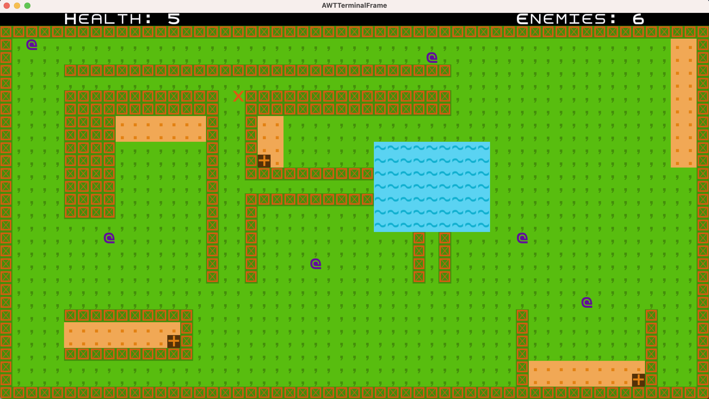
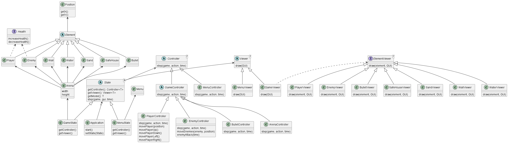

## LDTS_T01G03 - MINIFORTNITE

This project consists of a simplified Fortnite game, despite the original being played in online mode and with many more functionalities , this new version is more simplified and requires you to play with the keyboard and in offline mode. The game start with the player having 5 lives and some enemies, in order to survive and win the game, the player have to kill all the enemies and this happens if the player hits the enemies at least three times.
If an enemy kill the player first you lose.

This project was developed by __Elton Tamele__ (up201908676@fe.up.pt) and __Maureen Ah-shu__ (up201708043@fe.up.pt) for LDTS 2022⁄23.

### IMPLEMENTED FEATURES

- **Move** - To move the game character the player can use the arrow keys for any direction.
- **Kill** - The game character will shoot when the 's' key is pressed.
- **Quit** - The key 'q' can be used at any time to close the game.
- **Same Position** - If the enemy and the game character are in the same position the game character loses one life.
- **Hide** - The game character can hide in the water for surviving.
- **Safe House** - The game character can increase one life at the safe house.

### IMAGES

Character game trying to kill the enemy.

Character game hiding in the water.

Game arena.

### UML Diagram
