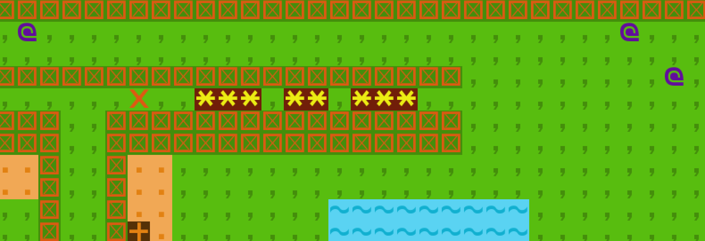
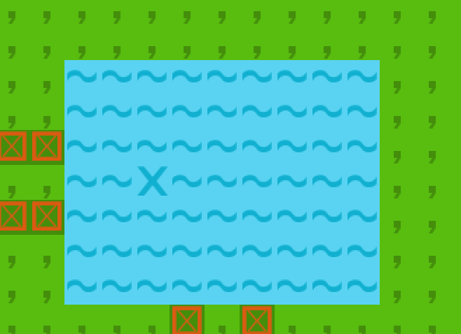
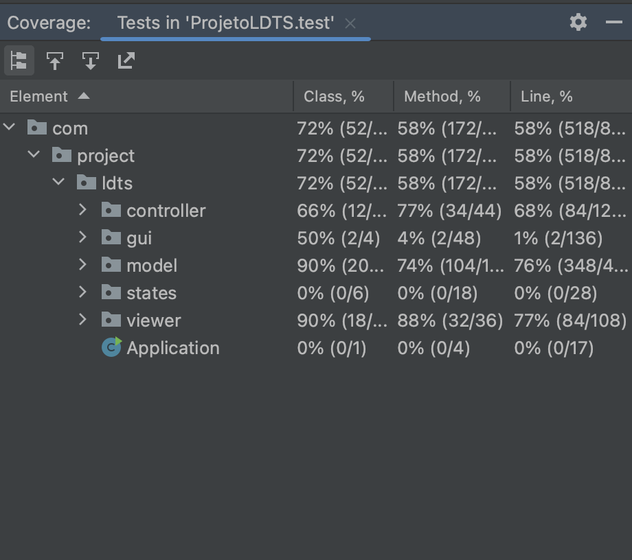
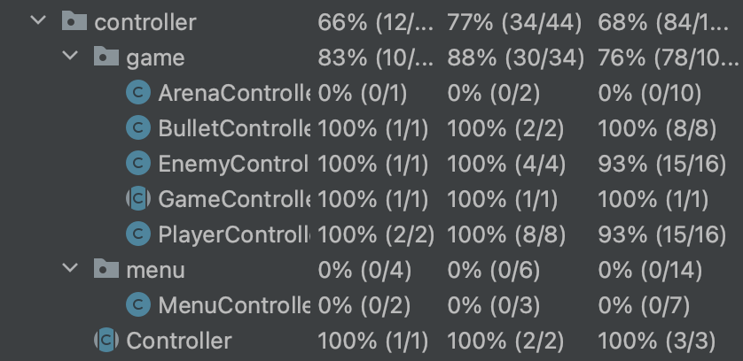
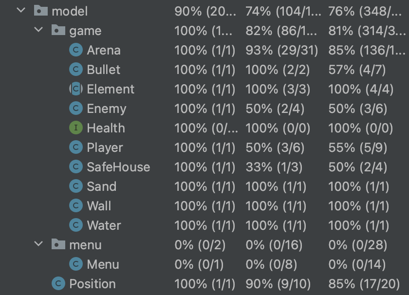
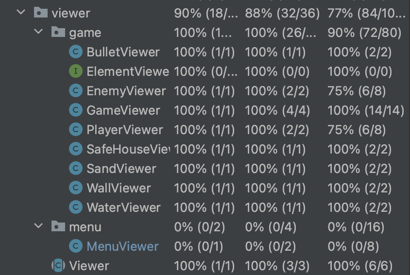

## LDTS_T01G03 - MINIFORTNITE

This project consists of a simplified Fortnite game, despite the original being played in online mode and with many more functionalities , this new version is more simplified and requires you to play with the keyboard and in offline mode. The game start with the player having 5 lives and some enemies, in order to survive and win the game, the player have to kill all the enemies and this happens if the player hits the enemies at least three times.
If an enemy kill the player first you lose.

This project was developed by __Elton Tamele__ (up201908676@fe.up.pt) and __Maureen Ah-shu__ (up201708043@fe.up.pt) for LDTS 2022⁄23.

### IMPLEMENTED FEATURES

- **Move** - To move the game character the player can use the arrow keys for any direction.
- **Kill** - The game character will shoot when the 's' key is pressed.
- **Quit** - The key 'q' can be used at any time to close the game.
- **Same Position** - If the enemy and the game character are in the same position the game character loses one life.
- **Hide** - The game character can hide in the water for surviving.
- **Safe House** - The game character can increase one life at the safe house.

### IMAGES

Character game trying to kill the enemy.

Character game hiding in the water.

### PLANNED FEATURES

- **Instructions** - A page that show instructions and maybe a tutorial.

- **Differents Arenas** - The user can change to a new arena.

- **Menus** - An final menu where the user can change its preferences, start a game and load game. When the game ends the player can start a new game, return to main menu or quit the game.

## DESIGN

### Game State
**Problem in Context**
  - During the game it is necessary to know its current state, if the game has already started, if it is running or if it has ended, having to be updated at each step of the game.

**The Pattern**
  - We used the State Pattern to solve our problem, we created an abstract State class that is updated on the current state of the game, being extended by two classes, GameState and MenuState, being able to update if the game is running or if it is still being initialized , if the player decides to finish, the game ends with a Null state.

**Implementation**
  - The Command class is implemented 

**Consequences**
  - Easy assignment of classes to be used depending on the current state
  Implementing predictable transitions between states

### MVC
**Problem in context**
 - Separate the data, interface and control of the game to have a more code reusability and to make the code more organized and easy to implement. 

**The Pattern**
 - The MVC pattern is a way to separate all the code in three elements, Model, View and Control. The Model does not have dependences, the View depends on the Model, and the Controller depends on both the Viewer and Model.

**Implementation.**
  - The main source directory of the project has three directories that represent one of the MVC elements, they are :

**Consequences.**
  - The program is easy to modify and to test because the three elements are isolated from each other.

### KNOWN CODE SMELLS AND REFACTORING SUGGESTIONS

### DATA CLASS

### TESTING

Tests coverage report.

Controller tests coverage report.

Model tests coverage report.

Viewer tests coverage report.

### Mutation Tests
- [Link](http://localhost:63342/ProjetoLDTS/build/reports/tests/test/index.html?_ijt=huj781qmpi2eivc0c8f16qa9jt&_ij_reload=RELOAD_ON_SAVE)
to mutation testing report.

### SELF-EVALUATION

Both of the components had a great participation on the project.

- Elton Tamele: 50%
- Maureen Ah-shu: 50%